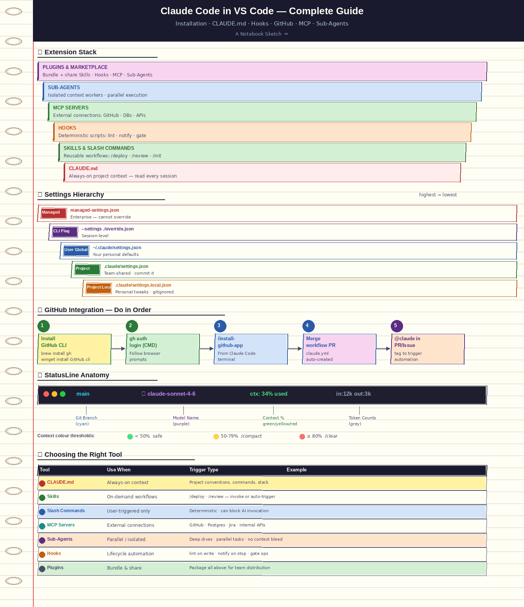
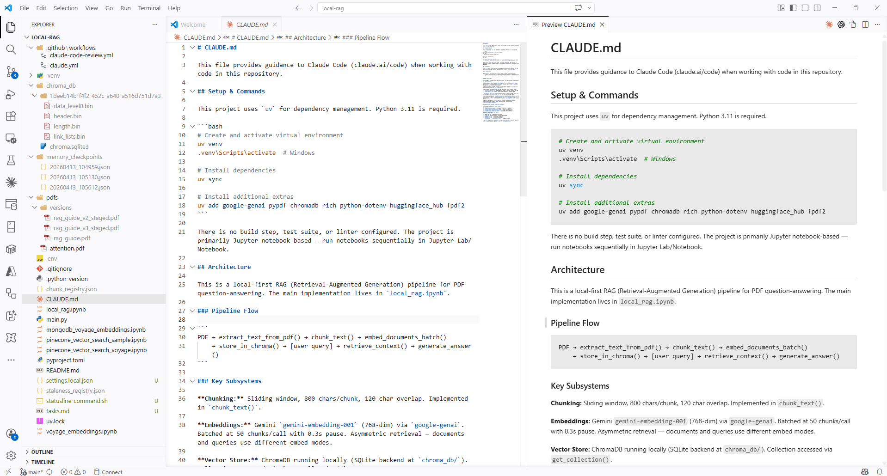
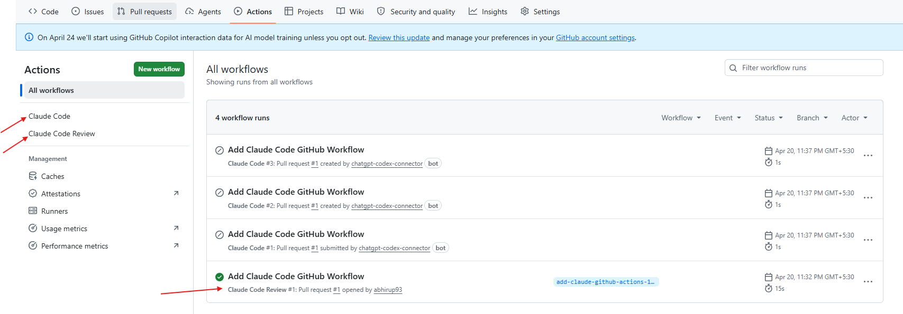

# The Complete Developer's Guide to Claude Code in VS Code: From Zero to Autonomous AI Dev Workflows

> *A production-grade, end-to-end reference covering installation, CLAUDE.md, Hooks, GitHub Actions, MCP, Sub-Agents, FastMCP, and everything in between.*

---

Off late I was digging deep into something that I honestly couldn't stop thinking about — **how to use Claude Code inside VS Code, end to end, the right way**.

Not the "here's how to install it" way. The real way — where you understand *why* each layer exists, *when* to reach for each tool, and *how* to wire it all together into something that actually changes how you write software day to day.

I started with the basics: installation, CLAUDE.md, slash commands. Then I kept pulling the thread — hooks, GitHub Actions automation, MCP servers, sub-agents, FastMCP, plugin marketplaces. Every layer unlocked something new. And the more I explored, the more I realised most guides out there stop at 20% of the picture.

So I decided to write the guide I wish existed when I started. Every section is verified against current docs, every code snippet is real, and every architectural diagram is drawn from how these pieces actually connect — not how they're marketed.

Whether you're just getting started or you're already running Claude in your terminal and want to go deeper — this is for you.

---

## Table of Contents

1. [Getting Started: Install Claude Code in VS Code](#1-getting-started-install-claude-code-in-vs-code)
2. [Starting a Sample Project & Creating CLAUDE.md with `/init`](#2-starting-a-sample-project--creating-claudemd-with-init)
3. [Understanding Claude Code Plugin Settings](#3-understanding-claude-code-plugin-settings)
4. [Using Claude Code in the Terminal](#4-using-claude-code-in-the-terminal)
5. [Fixing Bugs with Claude](#5-fixing-bugs-with-claude)
6. [Working with Slash Commands](#6-working-with-slash-commands)
7. [Using Hooks for Notifications & Automation](#7-using-hooks-for-notifications--automation)
8. [Claude Code + GitHub Integration: Automating Dev Tasks](#8-claude-code--github-integration-automating-dev-tasks)
9. [Using StatusLine: Monitor Context, Tokens & Model](#9-using-statusline-monitor-context-tokens--model)
10. [Using `tasks.md` to Track AI Coding Changes](#10-using-tasksmd-to-track-ai-coding-changes)
11. [Install, Connect & Use MCP Tools in Claude](#11-install-connect--use-mcp-tools-in-claude)
12. [MCP vs CLI: When to Use Which](#12-mcp-vs-cli-when-to-use-which)
13. [Building Your Own MCP Tool with FastMCP (Python + uv)](#13-building-your-own-mcp-tool-with-fastmcp-python--uv)
14. [Connecting Custom MCP with Claude Code](#14-connecting-custom-mcp-with-claude-code)
15. [Understanding, Creating & Using Sub-Agents](#15-understanding-creating--using-sub-agents)
16. [Building & Automating Workflows with Sub-Agents](#16-building--automating-workflows-with-sub-agents)
17. [Skills vs MCP vs Sub-Agents vs Slash Commands: The Decision Matrix](#17-skills-vs-mcp-vs-sub-agents-vs-slash-commands-the-decision-matrix)
18. [Claude Marketplace & Plugins](#18-claude-marketplace--plugins)
19. [Effective Ways to Create Skills, Hooks & Commands](#19-effective-ways-to-create-skills-hooks--commands)
20. [Testing AI-Generated Code](#20-testing-ai-generated-code)
21. [Final Thoughts](#21-final-thoughts)

---

## A Quick Word on Claude Code's Evolution

Claude Code launched in February 2025 as a terminal-based agentic coding tool. By mid-2026 it's an extensible platform running in your CLI, VS Code, JetBrains, a standalone desktop app, and on the web at `claude.ai/code`. It can read and write files, run shell commands, spawn parallel agents, connect to external services via MCP, and integrate natively into GitHub workflows.

The extension ecosystem built up fast — MCP in Nov 2024, Sub-agents in Jul 2025, Hooks in Sep 2025, Plugins in Oct 2025, Skills in Oct 2025, Agent Teams in Feb 2026. Each release added a new layer. This guide covers all of them, in the order they build on each other.

Let's build.



---

## 1. Getting Started: Install Claude Code in VS Code

### Prerequisites

- **Node.js 18+** (Claude Code is distributed as an npm package)
- **VS Code** (latest stable)
- An **Anthropic account** with API access or a Claude Pro/Max subscription

### Installation

```bash
# Install Claude Code globally via npm
npm install -g @anthropic-ai/claude-code
```

> ⚠️ Note: Some older guides reference a native binary installer. As of 2026, the npm method is the canonical path for most setups. Verify the latest at [docs.claude.com](https://docs.claude.com).

### VS Code Extension

1. Open VS Code → Extensions (`Ctrl+Shift+X`)
2. Search **"Claude Code"** → Install the official **Anthropic** extension (2M+ installs, verified publisher)
3. The **Spark icon** (⚡) appears in the sidebar — Claude Code now runs directly in your IDE

### Authentication

```bash
claude   # launches Claude Code
# A browser window opens → log into your Anthropic account
# Copy the auth code and paste into the terminal
```

### Architecture Overview

```
┌──────────────────────────────────────────────────────────────┐
│                      Your Workspace                          │
│                                                              │
│  ┌─────────────┐    ┌────────────────┐    ┌──────────────┐  │
│  │  VS Code    │◄──►│  Claude Code   │◄──►│  Terminal    │  │
│  │  Extension  │    │  Core Engine   │    │  (CLI)       │  │
│  └─────────────┘    └───────┬────────┘    └──────────────┘  │
│                             │                                │
│              ┌──────────────┼──────────────┐                │
│              ▼              ▼              ▼                │
│         ┌─────────┐  ┌──────────┐  ┌──────────┐            │
│         │  Files  │  │  Shell   │  │  MCP     │            │
│         │  (R/W)  │  │  (exec)  │  │  Servers │            │
│         └─────────┘  └──────────┘  └──────────┘            │
└──────────────────────────────────────────────────────────────┘
```

---

## 2. Starting a Sample Project & Creating CLAUDE.md with `/init`

### What is CLAUDE.md?

`CLAUDE.md` is Claude Code's **persistent project memory**. Every session, Claude reads this file automatically — it's always-on context. Think of it as the `README.md` that Claude actually reads before touching your code.

### Creating It with `/init`

```bash
cd my-project
claude
> /init
```

Claude scans your project structure, infers coding conventions, and generates a `CLAUDE.md` tailored to your repo. For example:

```markdown
# CLAUDE.md — my-project

## Project Overview
Python FastAPI service for inventory management.

## Code Style
- PEP 8 compliance enforced via Ruff
- Type hints required on all public functions
- 100-char line limit

## Architecture
- src/api/       → FastAPI route handlers
- src/services/  → Business logic layer
- src/models/    → SQLAlchemy ORM models

## Testing
- pytest with pytest-asyncio
- Run: `pytest tests/ -v`
- Coverage target: 85%+

## Commands
- Start dev server: `uvicorn src.main:app --reload`
- Lint: `ruff check .`
- Format: `ruff format .`
```



### CLAUDE.md Discovery Order

Claude searches for `CLAUDE.md` in this priority order:

```
1. ~/.claude/CLAUDE.md         (global user-level, always loaded)
2. <project-root>/CLAUDE.md    (project-level)
3. Any parent-directory CLAUDE.md up the tree
4. Nested CLAUDE.md in subdirs (loaded when Claude navigates into them)
```

**Best practice:** Keep the root `CLAUDE.md` concise. Use nested `CLAUDE.md` files in subdirectories like `src/api/CLAUDE.md` to give Claude context-aware guidance.

### Sample Project Bootstrap Workflow

```
/init
  └─► Claude scans repo structure
  └─► Infers tech stack, dependencies, naming conventions
  └─► Generates CLAUDE.md draft
  └─► You review + commit → Claude now "knows" your project
```

---

## 3. Understanding Claude Code Plugin Settings

Claude Code settings live at `~/.claude/settings.json` (user-level) and `.claude/settings.json` (project-level). Project-level overrides user-level.

### Key Settings

```json
{
  "model": "claude-sonnet-4-6",
  "permissions": {
    "allow": ["Bash(git:*)", "Bash(npm:*)", "Read", "Write", "Edit"],
    "deny": ["Bash(rm -rf:*)"]
  },
  "env": {
    "NODE_ENV": "development"
  },
  "hooks": { ... },
  "mcpServers": { ... }
}
```

### VS Code Extension Settings

In VS Code, open `Settings` → search **Claude Code**. Key knobs:

| Setting | Description |
|---|---|
| `claudeCode.model` | Model override for the IDE session |
| `claudeCode.autoApprove` | Skip confirmation for low-risk edits |
| `claudeCode.theme` | Light/dark rendering in inline diffs |
| `claudeCode.terminalSetup` | Auto-configure Shift+Enter for multiline input |

Run `/terminal-setup` inside a Claude Code session to auto-configure multi-line keybindings in VS Code's integrated terminal. No manual editing required.

### Permission Modes

| Mode | Behaviour |
|---|---|
| `default` | Claude asks for confirmation on risky operations |
| `auto-edit` | Approves file edits, asks for shell commands |
| `yolo` | Approves everything (use in isolated environments only) |

Cycle permission modes with `Meta+M` (Mac) / `Alt+M` (Windows/Linux) during a session.

---

## 4. Using Claude Code in the Terminal

The terminal is Claude Code's native environment. The VS Code extension is a UI layer on top of the same CLI.

### Basic Invocation Patterns

```bash
# Start interactive session
claude

# One-shot task (non-interactive)
claude -p "Add input validation to src/api/users.py"

# Print mode (output only, no interaction)
claude --print "Explain the auth flow in src/auth/"

# Resume last session
claude --resume

# Start with a specific model
claude --model claude-opus-4-6
```

### Navigating During a Session

```
/help           → list all slash commands
/status         → context usage, model, token count
/compact        → summarize conversation to free context
/clear          → start fresh (preserves CLAUDE.md)
Ctrl+C          → interrupt current operation
Shift+Enter     → multiline input (after /terminal-setup)
```

### Real Workflow: Explore a New Codebase

```bash
claude
> Explore the codebase. Summarise the architecture, key modules,
  and any obvious tech debt. Don't modify anything yet.
```

Claude reads files, follows imports, and produces a structured summary — no grep-and-pray needed.

---

## 5. Fixing Bugs with Claude

This is where most people start — and where Claude Code genuinely shines.

### Pattern 1: Paste the Error

```bash
> I'm seeing this error when running pytest:
  
  FAILED tests/test_pipeline.py::test_ingest - 
  ValueError: date value out of range: 10000-01-01
  
  Find the root cause and fix it.
```

Claude will: trace the stacktrace → locate the source → propose a fix → apply it → re-run the test.

### Pattern 2: Point at the File

```bash
> The function `parse_sharepoint_dates` in src/utils/sharepoint_utils.py
  is returning incorrect timestamps for timezone-aware datetimes.
  Find the bug and fix it without changing the function signature.
```

### Pattern 3: Git Bisect + Claude

```bash
> git log shows this worked 3 commits ago. Use git bisect to find
  the breaking commit and tell me what changed.
```

### Bug Fix Workflow

```
You describe bug
       │
       ▼
Claude reads relevant files
       │
       ▼
Claude traces execution path
       │
       ▼
Claude proposes fix (shows inline diff in VS Code)
       │
  ┌────┴────┐
Accept?    Reject?
  │              │
  ▼              ▼
Applied     Claude retries
  │
  ▼
Run tests to verify
```

### Best Practices

- Always include the **full error message** and **stack trace**
- Tell Claude what you've already tried ("I ruled out X because...")
- Use `--allowedTools "Bash(pytest:*)"` to let Claude run tests autonomously

---

## 6. Working with Slash Commands

Slash commands are user-initiated shortcuts — deterministic entry points into repeatable workflows.

### Built-in Commands

```
/init           → Generate CLAUDE.md
/compact        → Compress conversation context
/status         → Token usage, model, context stats
/clear          → Fresh session
/mcp            → Manage MCP servers
/hooks          → Interactive hook configuration
/plugin         → Install/manage plugins
/install-github-app  → Set up GitHub Actions
/terminal-setup → Configure VS Code terminal keybindings
/help           → Full command reference
```

### Custom Slash Commands

Create a markdown file in `.claude/commands/` (project) or `~/.claude/commands/` (global):

```markdown
<!-- .claude/commands/review.md -->
---
name: review
description: Full code review with security and performance checks
allowed-tools: Read, Grep, Glob
---

Review the changed files in this PR. Check for:
1. Potential bugs or edge cases
2. Security issues (input validation, injection risks)
3. Performance anti-patterns
4. Consistency with CLAUDE.md style conventions

Output a structured report with severity tags: [CRITICAL], [WARNING], [INFO]
```

Now `/review` is available in every session in this project.

### Command Scoping

| Scope | Location | Who can invoke |
|---|---|---|
| Project | `.claude/commands/` | Anyone in the repo |
| User | `~/.claude/commands/` | You, across all projects |
| Managed | Set by admins | Enforced team-wide |
| Plugin | Installed via `/plugin` | Based on plugin config |

### Disable Model Invocation

```markdown
---
name: deploy
description: Deploy to production
disable-model-invocation: true   # You-only — Claude cannot auto-trigger this
allowed-tools: Bash(npm:*), Bash(git:*)
---

Run production deployment:
1. npm run test
2. npm run build
3. git push origin main
```

This creates `/deploy` that only you can invoke — Claude will never call it on its own.

---

## 7. Using Hooks for Notifications & Automation

Hooks are **deterministic scripts** that fire at specific lifecycle events. They run outside Claude's reasoning loop — no AI involved, just pure automation.

Think of them as Git hooks, but for Claude Code's entire workflow.

### Hook Events

| Event | Fires When |
|---|---|
| `PreToolUse` | Before Claude calls any tool |
| `PostToolUse` | After a tool call completes |
| `Notification` | Claude wants to notify you |
| `Stop` | Claude finishes a task |
| `SubagentStop` | A sub-agent completes |
| `PreCompact` | Before context compaction |
| `Setup` | On `--init` or `--maintenance` |

### Configuring Hooks

In `~/.claude/settings.json` or `.claude/settings.json`:

```json
{
  "hooks": {
    "PostToolUse": [
      {
        "matcher": "Write|Edit",
        "hooks": [
          {
            "type": "command",
            "command": "npm run lint -- $CLAUDE_TOOL_INPUT_PATH"
          }
        ]
      }
    ],
    "Stop": [
      {
        "hooks": [
          {
            "type": "command",
            "command": "notify-send 'Claude Code' 'Task complete'"
          }
        ]
      }
    ]
  }
}
```

Or configure interactively: `> /hooks`

### Practical Hook Recipes

**Auto-lint on every file write:**
```json
"PostToolUse": [{
  "matcher": "Write",
  "hooks": [{"type": "command", "command": "ruff check $CLAUDE_TOOL_INPUT_PATH --fix"}]
}]
```

**Block dangerous bash commands:**
```json
"PreToolUse": [{
  "matcher": "Bash",
  "hooks": [{"type": "command", "command": "~/.claude/hooks/safety_check.sh"}]
}]
```

**Desktop notification when Claude finishes:**
```json
"Stop": [{
  "hooks": [{"type": "command", "command": "osascript -e 'display notification \"Claude finished\" with title \"Claude Code\"'"}]
}]
```

**Slack alert on sub-agent completion (for long-running tasks):**
```json
"SubagentStop": [{
  "hooks": [{
    "type": "command",
    "command": "curl -X POST $SLACK_WEBHOOK -d '{\"text\": \"Sub-agent task complete\"}'"
  }]
}]
```

### Hook Execution Flow

```
Claude calls a tool (e.g., Write file)
        │
        ▼
PreToolUse hooks fire (can block!)
        │
        ▼
Tool executes
        │
        ▼
PostToolUse hooks fire
        │
        ▼
Claude reads hook output (if any)
        │
        ▼
Claude continues or adjusts
```

> Hook output returned to `stdout` is injected back into Claude's context as tool results. Use this to feed Claude validation results.

---

## 8. Claude Code + GitHub Integration: Automating Dev Tasks

<cite index="11-1">Claude Code GitHub Actions brings AI-powered automation directly into your GitHub workflow. With a simple `@claude` mention in any PR or issue, Claude can analyze code, create pull requests, implement features, and fix bugs — all while following your project's standards.</cite>

There are **three steps you must complete in order** before any of this works. Most guides skip steps 1 and 2 entirely, which is why people hit 404s and auth errors when they try `/install-github-app`.

---

### Step 1: Install GitHub CLI

Claude Code uses the `gh` CLI under the hood to interact with GitHub — creating PRs, reading issues, pushing branches. Without it installed and authenticated, `/install-github-app` will fail silently or error out.

**macOS:**
```bash
brew install gh
```

**Windows:**
```bash
winget install --id GitHub.cli
```

**Linux (Debian/Ubuntu):**
```bash
(type -p wget >/dev/null || (sudo apt update && sudo apt install wget -y)) \
&& sudo mkdir -p -m 755 /etc/apt/keyrings \
&& wget -qO- https://cli.github.com/packages/githubcli-archive-keyring.gpg \
   | sudo tee /etc/apt/keyrings/githubcli-archive-keyring.gpg > /dev/null \
&& sudo apt update && sudo apt install gh -y
```

Verify it's installed:
```bash
gh --version
```

---

### Step 2: Authenticate the GitHub CLI

Open your **CMD or terminal** (not Claude Code — this is a regular shell step) and run:

```bash
gh auth login
```

You'll be walked through an interactive prompt:

```
? What account do you want to log into?  › GitHub.com
? What is your preferred protocol for Git operations?  › HTTPS
? Authenticate Git with your GitHub credentials?  › Yes
? How would you like to authenticate GitHub CLI?  › Login with a web browser

! First copy your one-time code: XXXX-XXXX
Press Enter to open github.com in your browser...
✓ Authentication complete.
✓ Logged in as your-username
```

Verify authentication worked:
```bash
gh auth status
```

Expected output:
```
github.com
  ✓ Logged in to github.com as your-username
  ✓ Git operations for github.com configured to use https protocol
  ✓ Token: gho_****
```

> ⚠️ Do not skip this step. `/install-github-app` calls `gh` internally — if `gh` isn't authenticated, the command will fail with a permissions error and you'll have no clear indication why.

---

### Step 3: Run `/install-github-app` from Claude Code

Now open Claude Code — either in your terminal or the VS Code extension — navigate to your project, and run:

```bash
> /install-github-app
```

This guides you through:
1. Installing the Claude GitHub App to your repo (opens browser for repo selection)
2. Granting read/write permissions on Contents, Issues, and Pull Requests
3. Auto-creating `.github/workflows/claude.yml` in your repo via a PR — merge it to activate

**Manual setup (if `/install-github-app` fails):** Visit `https://github.com/apps/claude`, install to your repo, then add `ANTHROPIC_API_KEY` to repo secrets under Settings → Secrets and variables → Actions.

### Step 4: The Workflow File

```yaml
name: Claude Code

on:
  issue_comment:
    types: [created]
  pull_request_review_comment:
    types: [created]
  issues:
    types: [opened, assigned]
  pull_request_review:
    types: [submitted]

jobs:
  claude:
    if: |
      (github.event_name == 'issue_comment' && contains(github.event.comment.body, '@claude')) ||
      (github.event_name == 'pull_request_review_comment' && contains(github.event.comment.body, '@claude')) ||
      (github.event_name == 'pull_request_review' && contains(github.event.review.body, '@claude')) ||
      (github.event_name == 'issues' && (contains(github.event.issue.body, '@claude') || contains(github.event.issue.title, '@claude')))
    runs-on: ubuntu-latest
    permissions:
      contents: read
      pull-requests: read
      issues: read
      id-token: write
      actions: read # Required for Claude to read CI results on PRs
    steps:
      - name: Checkout repository
        uses: actions/checkout@v4
        with:
          fetch-depth: 1

      - name: Run Claude Code
        id: claude
        uses: anthropics/claude-code-action@v1
        with:
          claude_code_oauth_token: ${{ secrets.CLAUDE_CODE_OAUTH_TOKEN }}

          # This is an optional setting that allows Claude to read CI results on PRs
          additional_permissions: |
            actions: read

          # Optional: Give a custom prompt to Claude. If this is not specified, Claude will perform the instructions specified in the comment that tagged it.
          # prompt: 'Update the pull request description to include a summary of changes.'

          # Optional: Add claude_args to customize behavior and configuration
          # See https://github.com/anthropics/claude-code-action/blob/main/docs/usage.md
          # or https://code.claude.com/docs/en/cli-reference for available options
          # claude_args: '--allowed-tools Bash(gh pr:*)'
```

### Step 5: Use It

**Interactive mode** — tag `@claude` in any comment:

```
@claude Fix the NullPointerException in UserService.java line 147 and open a PR
@claude Review this PR for security vulnerabilities
@claude Write unit tests for the new checkout flow
```

**Automation mode** — run headlessly on every PR:

```yaml
- uses: anthropics/claude-code-action@v1
  with:
    claude_code_oauth_token: ${{ secrets.CLAUDE_CODE_OAUTH_TOKEN }}
    direct_prompt: |
      Review the PR changes for potential bugs, style issues, and
      adherence to CLAUDE.md conventions. Post a detailed comment.
```

### Complete GitHub Automation Architecture

```
┌─────────────────────────────────────────────────────────┐
│                   GitHub Repository                     │
│                                                         │
│  Issue created / PR opened / @claude comment            │
│         │                                               │
│         ▼                                               │
│  GitHub Actions Trigger                                 │
│         │                                               │
│         ▼                                               │
│  anthropics/claude-code-action@v1                       │
│         │                                               │
│    ┌────┴─────────────────┐                            │
│    ▼                      ▼                            │
│  Interactive Mode    Automation Mode                    │
│  (responds to        (direct_prompt in                  │
│  @claude mentions)    workflow YAML)                    │
│         │                      │                       │
│         └──────────┬───────────┘                       │
│                    ▼                                    │
│         Claude reads repo + CLAUDE.md                   │
│                    │                                    │
│         ┌──────────┴──────────┐                        │
│         ▼                     ▼                        │
│    Creates PR            Posts review comment          │
│    with fix              on PR/Issue                   │
└─────────────────────────────────────────────────────────┘
```

### Automating CI Failure Fixes

```yaml
name: Auto-Fix CI Failures
on:
  workflow_run:
    workflows: ["CI"]
    types: [completed]

jobs:
  auto-fix:
    if: github.event.workflow_run.conclusion == 'failure'
    runs-on: ubuntu-latest
    steps:
      - uses: actions/checkout@v4
      - uses: anthropics/claude-code-action@v1
        with:
          claude_code_oauth_token: ${{ secrets.CLAUDE_CODE_OAUTH_TOKEN }}
          direct_prompt: |
            The CI pipeline failed. Analyze the failure logs,
            identify the root cause, fix it, and open a PR.
```

### Automating Code Review

```yaml
name: Claude Code Review

on:
  pull_request:
    types: [opened, synchronize, ready_for_review, reopened]
    # Optional: Only run on specific file changes
    # paths:
    #   - "src/**/*.ts"
    #   - "src/**/*.tsx"
    #   - "src/**/*.js"
    #   - "src/**/*.jsx"

jobs:
  claude-review:
    # Optional: Filter by PR author
    # if: |
    #   github.event.pull_request.user.login == 'external-contributor' ||
    #   github.event.pull_request.user.login == 'new-developer' ||
    #   github.event.pull_request.author_association == 'FIRST_TIME_CONTRIBUTOR'

    runs-on: ubuntu-latest
    permissions:
      contents: read
      pull-requests: read
      issues: read
      id-token: write

    steps:
      - name: Checkout repository
        uses: actions/checkout@v4
        with:
          fetch-depth: 1

      - name: Run Claude Code Review
        id: claude-review
        uses: anthropics/claude-code-action@v1
        with:
          claude_code_oauth_token: ${{ secrets.CLAUDE_CODE_OAUTH_TOKEN }}
          plugin_marketplaces: 'https://github.com/anthropics/claude-code.git'
          plugins: 'code-review@claude-code-plugins'
          prompt: '/code-review:code-review ${{ github.repository }}/pull/${{ github.event.pull_request.number }}'
          # See https://github.com/anthropics/claude-code-action/blob/main/docs/usage.md
          # or https://code.claude.com/docs/en/cli-reference for available options
```



### Security Checklist

- ✅ Always use `${{ secrets.CLAUDE_CODE_OAUTH_TOKEN }}` — never hardcode keys
- ✅ Limit `allowed-tools` to the minimum required
- ✅ Set `permissions` at the job level, not repo-wide
- ✅ Review Claude's PRs before merging — treat them like any contributor's code
- ✅ Add a `CLAUDE.md` to define what Claude should and shouldn't touch

---

## 9. Using StatusLine: Monitor Context, Tokens & Model

The StatusLine is one of the most underrated features in Claude Code. It's a persistent, real-time status bar at the bottom of your session that shows you exactly what's happening — model, context usage, token counts, git branch — without you having to ask.

The real power comes from making it **custom**. You wire up a shell script, Claude Code pipes fresh JSON into it on every render cycle, and whatever your script prints to `stdout` becomes the status line. Stateless, composable, zero overhead.

### Wiring It Up in `settings.local.json`

```json
{
  "statusLine": {
    "type": "command",
    "command": "bash ~/.claude/scripts/statusline-command.sh"
  }
}
```

Claude Code will run this script periodically and display the output. The script receives a JSON payload via `stdin` containing the full session state.

### A Real-World StatusLine Script

Here's a production statusline script that surfaces git branch, model, context percentage (with colour-coded warnings), and token counts — all parsed from the JSON Claude Code pipes in:

```bash
#!/usr/bin/env bash
# Claude Code status line script
# Shows: git branch | model | context usage | token counts

input=$(cat)

# Parse fields from the JSON payload Claude Code pipes in via stdin
model=$(echo "$input"        | jq -r '.model.display_name // "Unknown Model"')
cwd=$(echo "$input"          | jq -r '.workspace.current_dir // .cwd // ""')
used_pct=$(echo "$input"     | jq -r '.context_window.used_percentage // empty')
input_tokens=$(echo "$input" | jq -r '.context_window.current_usage.input_tokens // empty')
output_tokens=$(echo "$input"| jq -r '.context_window.current_usage.output_tokens // empty')

# Get git branch (skip optional locks to avoid conflicts)
branch=""
if [ -n "$cwd" ] && [ -d "$cwd/.git" ] || git -C "$cwd" rev-parse --git-dir > /dev/null 2>&1; then
  branch=$(git -C "$cwd" symbolic-ref --short HEAD 2>/dev/null)
fi

# Build output parts
parts=()

# Git branch — cyan
if [ -n "$branch" ]; then
  parts+=("$(printf '\033[36m\xef\x94\xa0 %s\033[0m' "$branch")")
fi

# Model name — purple/magenta
if [ -n "$model" ]; then
  parts+=("$(printf '\033[35m\xe2\xa7\xab %s\033[0m' "$model")")
fi

# Context usage — colour-coded by threshold
if [ -n "$used_pct" ]; then
  used_int=$(printf '%.0f' "$used_pct")
  if [ "$used_int" -ge 80 ]; then
    color='\033[31m'   # red   ≥ 80%
  elif [ "$used_int" -ge 50 ]; then
    color='\033[33m'   # yellow ≥ 50%
  else
    color='\033[32m'   # green  < 50%
  fi
  parts+=("$(printf "${color}ctx: %s%% used\033[0m" "$used_int")")
fi

# Token counts (only when both are available)
if [ -n "$input_tokens" ] && [ -n "$output_tokens" ]; then
  parts+=("$(printf '\033[90min:%s out:%s\033[0m' "$input_tokens" "$output_tokens")")
fi

# Join parts with a separator and print
(IFS='  '; echo "${parts[*]}")
```

### How It Works

Claude Code pipes a **fresh JSON blob to `stdin`** on every render cycle. Your script is stateless — it parses, formats, and exits. No polling, no background processes.

The JSON payload structure looks like this:

```json
{
  "model": { "display_name": "claude-sonnet-4-6" },
  "workspace": { "current_dir": "/home/user/my-project" },
  "context_window": {
    "used_percentage": 34.2,
    "remaining_percentage": 65.8,
    "current_usage": {
      "input_tokens": 12400,
      "output_tokens": 3100
    }
  }
}
```

The `jq -r '... // empty'` pattern on each field is deliberate defensive coding — if a field isn't available yet (e.g. token counts early in a session), it returns empty rather than crashing the whole status line.

### What the Output Looks Like

```
 main   claude-sonnet-4-6   ctx: 34% used   in:12400 out:3100
  │           │                    │                │
cyan       purple               green           dark grey
                              (→ yellow ≥ 50%)
                              (→ red    ≥ 80%)
```

### Context Management Strategies

Use the colour thresholds as action signals:

| StatusLine Colour | Context % | Action |
|---|---|---|
| 🟢 Green | < 50% | You're fine, keep going |
| 🟡 Yellow | 50–79% | Consider `/compact` to summarise history |
| 🔴 Red | ≥ 80% | Run `/compact` or start fresh with `/clear` |
| — | MCP overhead high | `/mcp disable <server>` to free tokens |
| — | Sub-agent spawned | Isolated context — no cost to your main session |

### One Tip on File Location

Keep this script somewhere stable — not in `Downloads/`. A good home is:

```bash
~/.claude/scripts/statusline-command.sh
chmod +x ~/.claude/scripts/statusline-command.sh
```

Then reference it in `settings.local.json` with the `~` path. This way it survives across project changes and won't get accidentally deleted.

---

## 10. Using `tasks.md` to Track AI Coding Changes

When Claude makes multiple changes across a session, it's easy to lose track of what was added, modified, or refactored. A `tasks.md` file acts as a living changelog for your AI-assisted work.

### Setting It Up

Add this to your `CLAUDE.md`:

```markdown
## Change Tracking Protocol
Whenever you make significant changes (new files, refactors, schema changes),
append an entry to `tasks.md` in the following format:

```
### [DATE] [TYPE] — Short description
- **Files changed:** list of paths
- **What changed:** 1–2 sentence summary
- **Why:** Reason or linked issue
- **Reversible:** Yes/No + how to revert
```
```

### Sample tasks.md

```markdown
# AI Coding Changes Log

### 2026-04-21 [REFACTOR] — Extracted date parsing utility
- **Files changed:** `src/utils/date_utils.py` (new), `src/pipeline/ingest.py`
- **What changed:** Moved all datetime parsing logic into a dedicated utility
  module. Handles timezone-aware and naive datetimes uniformly.
- **Why:** Fix for streaming pipeline failure with out-of-range dates (10000-01-01)
- **Reversible:** Yes — revert src/utils/date_utils.py and inline original logic

### 2026-04-20 [FEATURE] — Added retry logic to SharePoint connector
- **Files changed:** `src/utils/sharepoint_utils_v2.py`
- **What changed:** Added exponential backoff (max 3 retries), status code
  validation, and 30s timeout on Graph API calls.
- **Why:** Flaky production failures during SharePoint ingestion jobs
- **Reversible:** Yes — remove retry decorator, revert to single-attempt calls
```

This becomes a searchable, reviewable history of everything Claude touched — especially valuable when you're doing AI-assisted development across multiple sessions.

---

## 11. Install, Connect & Use MCP Tools in Claude

**MCP (Model Context Protocol)** is Anthropic's open standard for connecting Claude to external tools and data sources. Think of it as USB-C for AI — a universal adapter for GitHub, databases, APIs, and internal services.

### Installing a Public MCP Server

```bash
# Add the official GitHub MCP server
claude mcp add github -- npx @modelcontextprotocol/server-github

# Add Playwright for browser automation
claude mcp add playwright -- npx @playwright/mcp@latest

# Add a filesystem server
claude mcp add filesystem -- npx @modelcontextprotocol/server-filesystem /path/to/dir
```

### Scoping: Where Does the Server Live?

```bash
# Local (just this session)
claude mcp add my-server --scope local -- command

# User (all your projects)
claude mcp add my-server --scope user -- command

# Project (everyone in the repo, via .claude/settings.json)
claude mcp add my-server --scope project -- command
```

### Managing MCP Servers

```bash
> /mcp                           # List all connected servers + token cost
> /mcp enable github             # Enable a disabled server
> /mcp disable playwright        # Disable without removing
claude mcp list                  # CLI: list all configured servers
claude mcp remove github         # CLI: remove a server
```

### Using MCP Tools in Conversation

Once connected, MCP tools are invoked naturally:

```
> Create a GitHub issue for the date parsing bug we just fixed

> Search our Postgres database for orders placed in the last 24h

> Run a browser test against the staging URL
```

MCP tools also surface as slash commands:

```
/mcp__github__create_issue
/mcp__playwright__create-test
```

### MCP Server Architecture

```
Claude Code (Client)
       │
       │  STDIO / HTTP / SSE transport
       ▼
MCP Server Process
       │
  ┌────┴────────────────────────────┐
  │  Tools    Resources    Prompts  │
  │  (POST)   (GET-like)  (Templates│
  └────┬────────────────────────────┘
       │
External System
(GitHub API / Postgres / Filesystem / etc.)
```

---

## 12. MCP vs CLI: When to Use Which

This is a question that trips up even experienced users. Here's the decision framework:

```
┌─────────────────────────────────────────────────────────────────┐
│                     MCP vs CLI Decision Tree                    │
│                                                                 │
│   Does the operation require a live connection to an           │
│   external service, API, or database?                           │
│         │                                                       │
│    ┌────┴────┐                                                  │
│   YES        NO                                                 │
│    │          │                                                 │
│    ▼          ▼                                                 │
│   MCP      Is it a one-time shell operation?                    │
│              │                                                  │
│         ┌────┴────┐                                             │
│        YES        NO                                            │
│         │          │                                            │
│         ▼          ▼                                            │
│        CLI       Is it a reusable workflow                      │
│              with structured input/output?                       │
│                    │                                            │
│               ┌────┴────┐                                       │
│              YES        NO                                      │
│               │          │                                      │
│               ▼          ▼                                      │
│    MCP (or Skill)    Bash tool / CLI                            │
└─────────────────────────────────────────────────────────────────┘
```

### Side-by-Side Comparison

| Dimension | MCP | CLI (Bash Tool) |
|---|---|---|
| **Use case** | External services, APIs, DBs | Local shell operations |
| **State** | Persistent connection | Stateless per-call |
| **Reusability** | High — structured tools | Medium — custom scripts |
| **Security** | Sandboxed tool definitions | Full shell access |
| **Setup** | Requires server process | Zero setup |
| **Best for** | GitHub, Jira, Postgres, DBT | git, pytest, file ops |

### Examples

| Task | Use |
|---|---|
| `git commit -m "fix: date parsing"` | CLI (Bash) |
| Create a GitHub PR with description | MCP (github server) |
| `pytest tests/ -v` | CLI (Bash) |
| Query Jira for open P1 issues | MCP (jira server) |
| Read a local config file | CLI (Read tool) |
| Fetch data from an internal REST API | MCP (custom server) |
| Run `ruff check .` | CLI (Bash / Hook) |
| Push metrics to Datadog | MCP (datadog server) |

---

## 13. Building Your Own MCP Tool with FastMCP (Python + uv)

**FastMCP** is the official high-level Python framework for building MCP servers. It turns standard Python functions into MCP tools with a single decorator — no protocol boilerplate required.

### Setup with uv

```bash
# Install uv (modern Python package manager)
curl -LsSf https://astral.sh/uv/install.sh | sh

# Create project
uv init my-mcp-server
cd my-mcp-server

# Add fastmcp dependency
uv add fastmcp
```

### Building a Code Quality MCP Server

```python
# server.py
from fastmcp import FastMCP
import subprocess
import json
from pathlib import Path

mcp = FastMCP("Code Quality Tools")

@mcp.tool()
def run_linter(file_path: str) -> dict:
    """
    Run Ruff linter on a Python file and return violations.
    Args:
        file_path: Absolute or relative path to the Python file
    Returns:
        Dictionary with violations list and summary stats
    """
    result = subprocess.run(
        ["ruff", "check", file_path, "--output-format", "json"],
        capture_output=True,
        text=True
    )
    violations = json.loads(result.stdout) if result.stdout else []
    return {
        "file": file_path,
        "violation_count": len(violations),
        "violations": violations,
        "clean": len(violations) == 0
    }

@mcp.tool()
def get_test_coverage(module_path: str) -> dict:
    """
    Run pytest with coverage for a specific module.
    Args:
        module_path: Path to the module to test (e.g., src/utils)
    Returns:
        Coverage report with percentage and uncovered lines
    """
    result = subprocess.run(
        ["pytest", f"--cov={module_path}", "--cov-report=json", "-q"],
        capture_output=True,
        text=True
    )
    if Path("coverage.json").exists():
        with open("coverage.json") as f:
            cov_data = json.load(f)
        return {
            "module": module_path,
            "coverage_percent": cov_data["totals"]["percent_covered"],
            "missing_lines": cov_data["totals"]["missing_lines"]
        }
    return {"error": result.stderr}

@mcp.resource("project://structure")
def get_project_structure() -> str:
    """Returns the high-level project directory structure."""
    result = subprocess.run(
        ["find", ".", "-type", "f", "-name", "*.py", 
         "-not", "-path", "./.venv/*"],
        capture_output=True, text=True
    )
    return result.stdout

if __name__ == "__main__":
    mcp.run()
```

### Key FastMCP Concepts

```python
# Tool — Claude calls this to perform actions
@mcp.tool()
def my_tool(param: str) -> dict: ...

# Resource — Claude reads this for context (GET-like)
@mcp.resource("data://my-resource")
def my_resource() -> str: ...

# Prompt — Reusable interaction templates
@mcp.prompt()
def my_prompt(context: str) -> str: ...
```

The **docstring** of each function becomes the tool description that Claude reads when deciding which tool to call. **Write clear, specific docstrings.**

---

## 14. Connecting Custom MCP with Claude Code

### Method 1: FastMCP Install Command (Recommended)

```bash
# Auto-installs your server into Claude Code
fastmcp install claude-code server.py

# With dependencies
fastmcp install claude-code server.py --with pandas --with requests

# With environment variables (API keys)
fastmcp install claude-code server.py \
  --server-name "Code Quality" \
  --env GITHUB_TOKEN=your_token

# Specific Python version
fastmcp install claude-code server.py --python 3.11
```

### Method 2: claude mcp add Command

```bash
# Add with uv runtime (handles dependencies automatically)
claude mcp add code-quality -- uv run --with fastmcp fastmcp run server.py

# Add with project scope (shared with team)
claude mcp add code-quality --scope project -- \
  uv run --project /path/to/my-mcp-server fastmcp run server.py
```

### Method 3: Manual settings.json

```json
{
  "mcpServers": {
    "code-quality": {
      "type": "stdio",
      "command": "uv",
      "args": ["run", "--with", "fastmcp", "fastmcp", "run", "/path/to/server.py"],
      "env": {
        "GITHUB_TOKEN": "${GITHUB_TOKEN}"
      }
    }
  }
}
```

### Verify Connection

```bash
claude
> /mcp
```

You should see your server listed with its tool names and token cost. Try it:

```
> Run the linter on src/utils/date_utils.py
```

Claude detects your `run_linter` tool and calls it automatically.

### Debugging

```bash
# Check server status
/mcp

# Common issues:
# 1. Server not connecting → check stdout pollution (no stray print statements)
# 2. Tools not discovered → ensure docstrings are present
# 3. Auth errors → verify env vars are passed correctly
```

---

## 15. Understanding, Creating & Using Sub-Agents

Sub-agents are **mini Claude instances with their own isolated context windows**. They handle specific tasks and report summaries back to the main session.

<cite index="4-1">Your main Claude session gets cluttered fast during complex work. Subagents solve this by spinning up separate AI instances — each with its own system prompt, tool permissions, and even a different model. A "code-reviewer" agent reads diffs. An "explorer" agent searches a massive repo. They work in isolation, then hand back a summary.</cite>

### Creating a Sub-Agent

Create a markdown file in `~/.claude/agents/` (global) or `.claude/agents/` (project):

```markdown
<!-- .claude/agents/code-reviewer.md -->
---
name: code-reviewer
description: Reviews Python code for quality, security, and performance issues.
  Invoke when code review is needed on changed files.
model: claude-opus-4-6
allowed-tools: Read, Grep, Glob
---

You are a senior Python code reviewer. When invoked, you receive a list of
changed files. For each file, review:

1. **Correctness** — Logic bugs, off-by-one errors, unhandled edge cases
2. **Security** — Input validation, injection risks, secret exposure
3. **Performance** — O(n²) patterns, unnecessary I/O, missing caching
4. **Style** — PEP 8 adherence, naming conventions, docstring quality

Output a structured report:

## Code Review Report

### [filename]
- CRITICAL: <issue> (line X)
- WARNING: <issue> (line X)
- INFO: <suggestion>

### Summary
Total issues: X (Y critical, Z warnings)
```

```markdown
<!-- .claude/agents/explorer.md -->
---
name: explorer
description: Deep-dives into a codebase section to map dependencies,
  understand data flow, and surface architectural patterns.
allowed-tools: Read, Grep, Glob, Bash(find:*)
context: fork
---

Explore the specified module thoroughly. Map:
- Entry points and public APIs
- Dependencies (internal and external)
- Data flow (inputs → transformations → outputs)
- Side effects (DB calls, file writes, network calls)

Return a structured architectural summary.
```

### Invoking Sub-Agents

```
# In a Claude Code session:
> @code-reviewer review the changes in src/pipeline/

> @explorer map the data flow through src/api/routes/

> Use the code-reviewer agent on all Python files modified in the last commit
```

### Sub-Agent Context Isolation

```
Main Session
│  Full conversation history
│  All loaded skills
│  All MCP connections
│  Context: e.g. 80,000 tokens
│
└──► Spawns @code-reviewer
     │
     │  Isolated context window
     │  Only: system prompt + agent's skills + what main session passed
     │  Context: ~5,000 tokens
     │  No access to main session history
     │
     ▼
     Returns summary to main session
     (summary added to main context, not the full sub-agent conversation)
```

This isolation prevents context bloat. Use sub-agents for work that doesn't need your full conversation history.

---

## 16. Building & Automating Workflows with Sub-Agents

Sub-agents become powerful when you chain them into pipelines.

### Pattern 1: Parallel Research

```markdown
> Research these three approaches to handling streaming date validation
  in Spark Structured Streaming:
  1. Schema enforcement at source
  2. Pre-filter with UDF
  3. ANALYZE TABLE side effects
  
  Spawn a separate sub-agent for each approach and have them report
  back concurrently.
```

Claude spawns three agents in parallel — each investigates one approach — then synthesizes the results. Same wall-clock time as one agent.

### Pattern 2: Plan-Then-Execute Pipeline

```markdown
<!-- .claude/agents/planner.md -->
---
name: planner
description: Creates detailed implementation plans for features.
  Invoke before writing any code.
allowed-tools: Read, Glob
---

Given a feature request, output a step-by-step implementation plan:
- Files to create/modify
- Functions to add/change
- Tests to write
- Potential breaking changes
- Estimated complexity: LOW / MEDIUM / HIGH
```

```markdown
<!-- .claude/commands/implement.md -->
---
name: implement
description: Plan and implement a feature using the planner agent
---

Step 1: Invoke @planner with the feature description: $ARGUMENTS
Step 2: Review the plan with the user (pause for confirmation)
Step 3: Implement the plan file by file
Step 4: Run tests after each file change
Step 5: Update tasks.md with the change log
```

Now `/implement add rate limiting to the API` triggers the full pipeline.

### Pattern 3: The PR Factory

```
User: /implement add retry logic to the Kafka consumer
         │
         ▼
@planner creates implementation plan
         │
         ▼  (user approves)
Main Claude implements changes
         │
         ▼
@code-reviewer reviews the changes
         │
         ▼
Main Claude fixes critical issues
         │
         ▼
Hook: auto-run pytest
         │
         ▼  (tests pass)
Claude creates PR via GitHub MCP
```

### Agent Teams (Feb 2026+)

<cite index="4-1">Unlike Subagents where you define system prompts and tool permissions in YAML config files, Agent Teams are configured through the prompt itself. You describe the roles and task, and the lead agent handles orchestration. Teammates inherit the lead's permissions and MCP connections.</cite>

```
> Assemble a team: a backend developer, a security reviewer,
  and a documentation writer. Implement JWT authentication
  for the user service, have security review it, and have
  docs write the API reference.
```

---

## 17. Skills vs MCP vs Sub-Agents vs Slash Commands: The Decision Matrix

This is the question that matters most for designing effective Claude Code setups.

```
┌─────────────────┬────────────────────────────────────────────────────┐
│   Extension     │  Use When...                                       │
├─────────────────┼────────────────────────────────────────────────────┤
│ CLAUDE.md       │ Always-on context: project conventions, tech stack │
│                 │ coding standards, command shortcuts                 │
├─────────────────┼────────────────────────────────────────────────────┤
│ Skills          │ Reusable workflows you invoke on-demand             │
│ (.md files)     │ "Here are the steps to do X" — repeatable prompts  │
│                 │ Can auto-trigger when Claude detects relevance      │
├─────────────────┼────────────────────────────────────────────────────┤
│ Slash Commands  │ User-initiated shortcuts with defined inputs        │
│                 │ Deterministic entry points: /deploy, /review        │
│                 │ Can disable model invocation (human-only trigger)   │
├─────────────────┼────────────────────────────────────────────────────┤
│ MCP Servers     │ Connect to external systems (APIs, DBs, services)  │
│                 │ Structured tools with schemas and responses         │
│                 │ Persistent connections across the session           │
├─────────────────┼────────────────────────────────────────────────────┤
│ Sub-Agents      │ Parallel or isolated work                          │
│                 │ Deep dives that would pollute main context         │
│                 │ Specialized roles (reviewer, explorer, planner)    │
├─────────────────┼────────────────────────────────────────────────────┤
│ Hooks           │ Deterministic automation: no AI reasoning needed   │
│                 │ Quality gates: lint, test, notify                  │
│                 │ Fires on lifecycle events (not user-triggered)      │
├─────────────────┼────────────────────────────────────────────────────┤
│ Plugins         │ Packaging and sharing combinations of the above    │
│                 │ Team standardization, marketplace distribution      │
└─────────────────┴────────────────────────────────────────────────────┘
```

### Common Combinations

**Solo developer setup:**
- `CLAUDE.md` → project context
- 3–4 skills → deploy, review, test, changelog
- 1–2 MCP servers → GitHub, filesystem
- Hooks → auto-lint on write, notify on stop

**Team setup:**
- Managed `CLAUDE.md` → enforced standards
- Plugin → shared skills + hooks + MCPs bundled
- Sub-agents → parallel review and exploration
- GitHub Actions → async PR automation

---

## 18. Claude Marketplace & Plugins

<cite index="3-1">Plugins are a lightweight way to package and share any combination of: Slash commands, Subagents, MCP servers, and Hooks. You can install plugins directly within Claude Code using the `/plugin` command, now in public beta.</cite>

### Installing a Plugin

```bash
> /plugin install <plugin-url-or-name>
```

Plugins toggle on/off as needed — disable them when not in use to reduce system prompt context.

### Notable Community Plugins

- **Compound Engineering Plugin** (EveryInc) — practical agents/skills/commands built around learning from mistakes
- **Context Engineering Kit** (Vlad Goncharov) — advanced context techniques with minimal token footprint
- **claudekit** (Carl Rannaberg) — auto-save checkpointing, code quality hooks, 20+ specialized sub-agents including `code-reviewer`, `typescript-expert`, `ai-sdk-expert`
- **claude-toolbox** (serpro69) — starter template with pre-configured MCP servers
- **awesome-claude-code** (hesreallyhim) — curated list on GitHub

### Building Your Own Plugin

A plugin is a directory with a `plugin.json` manifest:

```json
{
  "name": "my-team-plugin",
  "version": "1.0.0",
  "description": "Our team's standardized Claude Code setup",
  "commands": ["commands/review.md", "commands/deploy.md"],
  "agents": ["agents/code-reviewer.md", "agents/planner.md"],
  "hooks": {
    "PostToolUse": [...]
  },
  "mcpServers": {
    "internal-api": { ... }
  }
}
```

Host it on GitHub and share the URL. Teammates install with `/plugin install https://github.com/your-org/claude-plugin`.

### Plugin Marketplaces

<cite index="3-1">Anyone can build and host plugins and create plugin marketplaces — curated collections where other developers can discover and install plugins. For instance, engineer Dan Ávila's plugin marketplace offers plugins for DevOps automation, documentation generation, project management, and testing suites.</cite>

---

## 19. Effective Ways to Create Skills, Hooks & Commands

### The Anatomy of a Good Skill

```markdown
---
name: db-migration
description: Generates and runs Alembic database migrations safely.
  Auto-invoked when discussing schema changes or model updates.
allowed-tools: Read, Bash(alembic:*), Bash(python:*)
context: fork          # runs in isolated sub-agent context
---

When creating a database migration:

1. Read the current SQLAlchemy models in src/models/
2. Compare to the latest migration in alembic/versions/
3. Generate migration: `alembic revision --autogenerate -m "$ARGUMENTS"`
4. Review the generated migration for destructive operations
   (DROP TABLE, DROP COLUMN) — flag and ask user to confirm
5. Run migration in dry mode first: `alembic upgrade head --sql`
6. If safe, apply: `alembic upgrade head`
7. Update tasks.md with the schema change details
```

**What makes it good:**
- Specific `description` that enables accurate auto-invocation
- Explicit steps (deterministic workflow, not vague instructions)
- Safety gates before destructive operations
- Scoped `allowed-tools` — least privilege
- `context: fork` for isolation when the skill has side effects

### Hook Best Practices

```json
{
  "hooks": {
    "PostToolUse": [{
      "matcher": "Write|Edit",           // scope narrowly
      "hooks": [{
        "type": "command",
        "command": "~/.claude/hooks/validate_write.sh",
        "timeout": 10                    // always set timeouts
      }]
    }]
  }
}
```

**validate_write.sh:**
```bash
#!/bin/bash
# PostToolUse hook — validates every file write
FILE="$CLAUDE_TOOL_INPUT_PATH"

# Only process Python files
if [[ ! "$FILE" == *.py ]]; then exit 0; fi

# Run ruff, output to stdout so Claude can read it
ruff check "$FILE" --output-format json 2>/dev/null
```

Hook output to stdout is injected into Claude's context. If you return structured JSON, Claude can reason about it and self-correct.

### Command Creation Checklist

```
□ Name is a verb (review, deploy, analyze) — not a noun
□ Description is 1 sentence, specific enough to auto-invoke correctly
□ Steps are numbered and explicit
□ $ARGUMENTS is used where user input flows in
□ allowed-tools is scoped to minimum needed
□ disable-model-invocation is set for human-only commands
□ Tested in an isolated project before sharing
```

---

## 20. Testing AI-Generated Code

AI-generated code requires the same testing discipline as human-written code — arguably more, because AI can produce plausible-looking code with subtle logical errors.

### The Three-Layer Testing Strategy

```
┌─────────────────────────────────────────────────────┐
│              Layer 1: Unit Tests                    │
│  Claude writes them; you review the edge cases      │
│  Focus: individual functions, pure logic            │
├─────────────────────────────────────────────────────┤
│              Layer 2: Integration Tests             │
│  Test the seams between components                  │
│  Focus: DB calls, API contracts, data transforms    │
├─────────────────────────────────────────────────────┤
│              Layer 3: Smoke / Contract Tests        │
│  Run after every AI change in CI                    │
│  Focus: "did we break anything obvious?"            │
└─────────────────────────────────────────────────────┘
```

### Workflow: Test-Driven AI Development

```
1. Write the test first (or ask Claude to write it based on spec)
2. Verify the test FAILS (confirms it tests something real)
3. Ask Claude to implement the function until tests pass
4. Review: does the code match intent, or did Claude "cheat"?
5. Run full test suite (via Hook or manually)
6. Commit
```

### Asking Claude to Write Tests Well

```
> Write pytest tests for the `run_linter` function in server.py.
> 
> Requirements:
> - Test the happy path (file with no violations)
> - Test a file with violations (mock subprocess.run)
> - Test with a non-existent file path (error handling)
> - Use pytest fixtures for reusable file setup
> - Mock all subprocess calls — no real filesystem side effects
```

The more specific your requirements, the more useful the tests.

### Reviewing AI-Generated Tests

Watch for these AI test anti-patterns:

| Anti-pattern | Example | Fix |
|---|---|---|
| Testing the mock | Asserts mock was called, not that the function works | Add assertions on return values |
| Happy-path only | Only tests `result == expected` | Add edge cases: empty input, None, boundary values |
| Trivial coverage | 100% coverage, 0% confidence | Ask Claude to add adversarial inputs |
| Circular logic | Code and tests both have the same bug | Code review the logic independently |

### Automated Testing Hook

```json
"Stop": [{
  "hooks": [{
    "type": "command",
    "command": "pytest tests/ -q --tb=short 2>&1 | tail -20"
  }]
}]
```

This runs your test suite every time Claude finishes a task. The output is surfaced to Claude, which can see failures and self-correct before you even look.

---

## 21. Final Thoughts

Claude Code in 2026 is not a code autocomplete tool. It's an orchestration platform — one where the AI doesn't just suggest changes but plans, executes, tests, reviews, and ships them.

The extension hierarchy builds on itself:

```
CLAUDE.md           → What Claude always knows
Skills              → What Claude can recall on demand
Slash Commands      → What you trigger deterministically  
MCP Servers         → What Claude can reach externally
Sub-Agents          → How Claude parallelizes and isolates work
Hooks               → What happens automatically without reasoning
Plugins             → How you package and share all of the above
```

The developers getting the most out of Claude Code aren't the ones using the most features — they're the ones who've built the right `CLAUDE.md`, the right 3–4 skills, and the right hooks for their specific workflow. Start there. Add complexity only when you feel a real friction point.

One more thing: always review what Claude builds. The tools are remarkable, the judgment is still yours.

---

*Happy building. If this helped, follow me on [Medium @abhirup.pal93](https://medium.com/@abhirup.pal93) and [LinkedIn](https://linkedin.com/in/abhirup-pal-776066a1) for more data and AI engineering content.*

---

## Hashtags

`#ClaudeCode` `#AIEngineering` `#DeveloperTools` `#VSCode` `#MCP` `#ModelContextProtocol` `#AIAgents` `#FastMCP` `#GitHubActions` `#DevAutomation` `#Anthropic` `#AICoding` `#SoftwareEngineering` `#PythonDevelopment` `#DataEngineering` `#LLMTools` `#AgenticAI` `#Productivity` `#OpenSource` `#BuildWithClaude`
